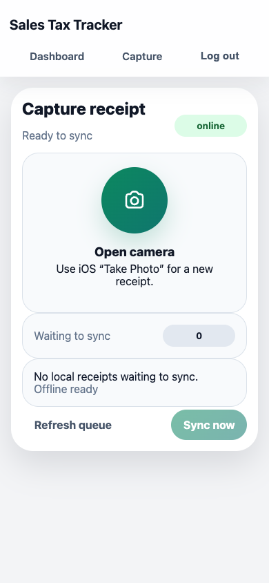
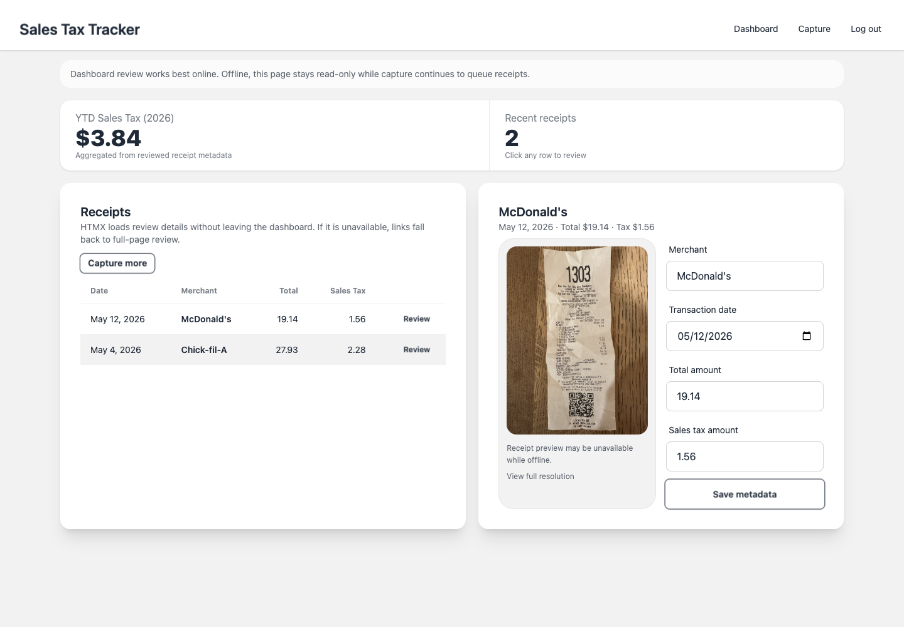

# Sales Tax Tracker

Private self-hosted receipt capture and review app for tracking year-to-date sales tax from photographed receipts.

This project is intended for personal use. It supports mobile receipt capture, offline queueing on the capture screen, server-side image storage, and receipt field extraction through an OpenAI-compatible Responses API.

## What It Does

- Capture receipt photos from a phone-friendly web UI
- Queue captures locally when the phone is offline
- Upload receipt images to RustFS/S3-compatible storage
- Extract merchant, date, total, and sales tax through an OpenAI-compatible Responses endpoint
- Review and correct receipt metadata in a Django dashboard

## Tech Stack

- Backend: Django 5.1, Django Ninja
- Frontend: Django templates, HTMX, Alpine.js, Tailwind CSS, DaisyUI
- Data: PostgreSQL
- Object storage: RustFS / S3-compatible storage
- Receipt extraction: OpenAI-compatible Responses API
- Runtime: Docker Compose, Gunicorn, WhiteNoise
- Tooling: uv, pytest, Ruff, pre-commit, GitHub Actions

## Screenshots

### Mobile Capture



### Desktop Dashboard



## Deployment Model

- Use Docker Compose for normal deployment
- Use Django login for app authentication
- You can still put the app behind a reverse proxy
- Default web binding is `127.0.0.1:8000` so it is not exposed directly by default
- The default Compose file uses the latest published GHCR image

Do not expose this app directly to the public internet without understanding the security implications.

## Quick Start

1. Copy `.env.example` to `.env` and fill in real values.
2. Pull the latest published image and start the app:

```bash
docker compose pull
docker compose up -d
```

3. Create a Django user in a second terminal:

```bash
docker compose exec web python manage.py createsuperuser
```

4. Open `http://127.0.0.1:8000/accounts/login/` and sign in.

5. Confirm the app is healthy:

```bash
curl http://127.0.0.1:8000/health/
```

## Required Configuration

The app will refuse to start unless these are configured:

- `DJANGO_SECRET_KEY`
- `DJANGO_ALLOWED_HOSTS`
- `RECEIPT_LLM_RESPONSES_URL`
- `RECEIPT_LLM_API_KEY`
- `RECEIPT_LLM_MODEL`

OpenAI example:

```env
RECEIPT_LLM_RESPONSES_URL=https://api.openai.com/v1/responses
RECEIPT_LLM_API_KEY=sk-...
RECEIPT_LLM_MODEL=gpt-4.1-mini
```

## Reverse Proxy Notes

- Keep the container bound to loopback unless a trusted reverse proxy fronts it.
- Make sure the proxy forwards the correct `Host` header.
- Add your public hostname to `DJANGO_ALLOWED_HOSTS`.
- If your browser origin differs from Django's effective origin, add it to `DJANGO_CSRF_TRUSTED_ORIGINS`.

## Development

Install dependencies locally:

```bash
uv sync --dev
```

Run tests:

```bash
uv run pytest
```

Run hooks:

```bash
uv run pre-commit run --all-files
```

Use the development compose override for live code mounts and Django `runserver`:

```bash
docker compose -f docker-compose.yml -f docker-compose.dev.yml up --build
```

`docker-compose.yml` is the reference deployment configuration. `docker-compose.dev.yml` adds the local image build, bind mounts, and Django `runserver` for development.

## Releases

Manual releases are driven by signed Git tags and publish multi-arch images to GitHub Container Registry.

Release flow:

1. Bump `version` in `pyproject.toml`.
2. Merge the version bump to `main`.
3. Create a signed tag that matches the version exactly:

```bash
git tag -s v0.1.0 -m "v0.1.0"
git push origin v0.1.0
```

4. GitHub Actions will:
- verify the tag matches `pyproject.toml`
- build and push `linux/amd64` and `linux/arm64` images to GHCR
- create a GitHub Release with generated release notes

Published image:

```text
ghcr.io/andrewtmendoza/sales_tax_tracker
```

Tag `v0.1.0` publishes:

- `ghcr.io/andrewtmendoza/sales_tax_tracker:0.1.0`
- `ghcr.io/andrewtmendoza/sales_tax_tracker:0.1`
- `ghcr.io/andrewtmendoza/sales_tax_tracker:0`
- `ghcr.io/andrewtmendoza/sales_tax_tracker:latest`
- `ghcr.io/andrewtmendoza/sales_tax_tracker:sha-<shortsha>`

## Versioning

- Pull requests targeting `main` must bump `pyproject.toml`.
- The release tag must match `pyproject.toml` exactly, using `vX.Y.Z`.
- Example: `version = "0.1.0"` requires the tag `v0.1.0`.

## Health Check

The app exposes a lightweight health endpoint at `/health/` for Docker and reverse proxy monitoring:

```bash
curl http://127.0.0.1:8000/health/
```

Expected response:

```json
{"status": "ok"}
```

## Backups

Back up Postgres:

```bash
docker compose exec db pg_dump -U "$POSTGRES_USER" "$POSTGRES_DB" > backup.sql
```

Back up RustFS data:

```bash
docker run --rm -v sales_tax_tracker_rustfs_data:/from -v "$PWD":/to alpine sh -c "cd /from && tar czf /to/rustfs-backup.tgz ."
```

## Privacy

- Receipt images are stored in your configured object storage.
- Raw model responses are stored in the database.
- When LLM extraction is enabled, receipt image data is sent to your configured model endpoint.

## Tax Disclaimer

This project helps organize receipt data. It does not provide tax, legal, or accounting advice.

## Repository Hygiene

- CI runs GitHub Actions for hooks, tests, and Docker builds.
- See `SECURITY.md` for security reporting and deployment expectations.
- See `CONTRIBUTING.md` for development workflow details.
